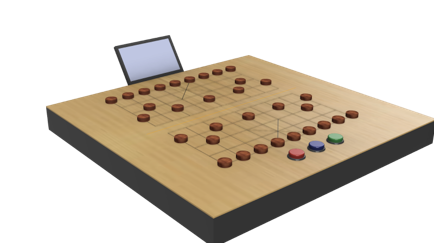
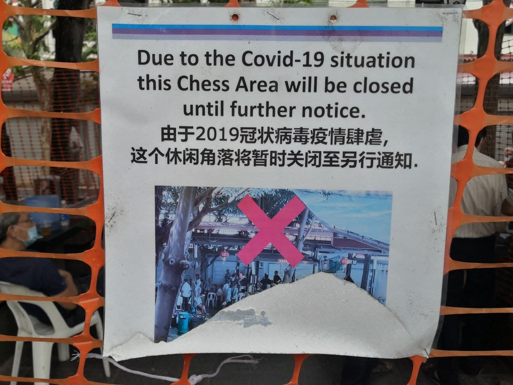
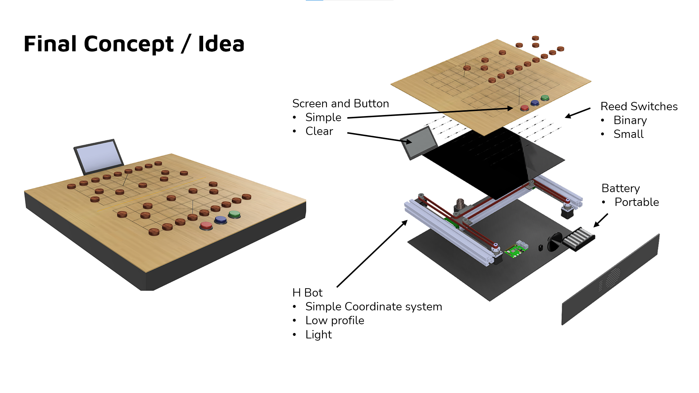
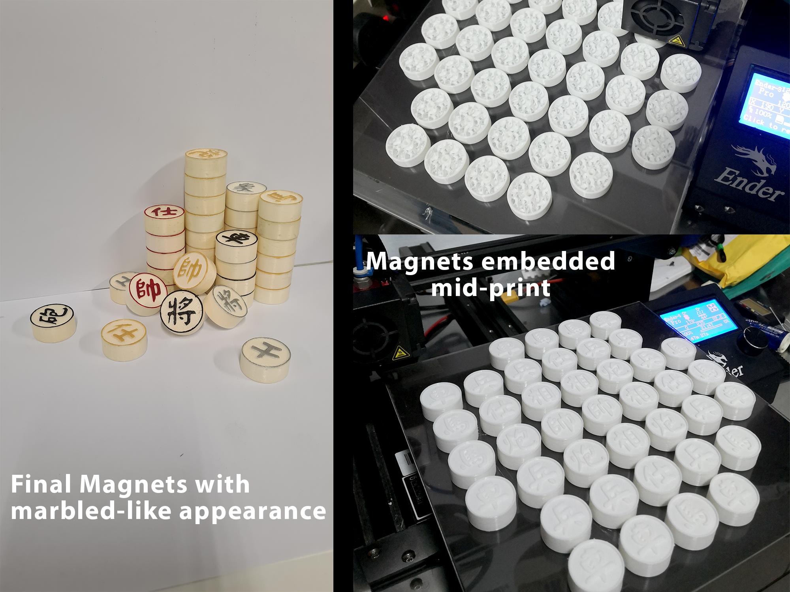
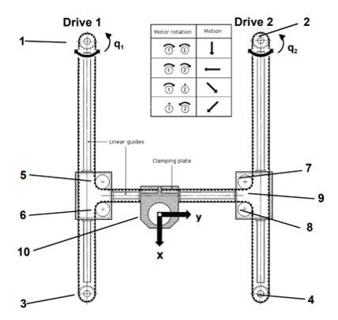
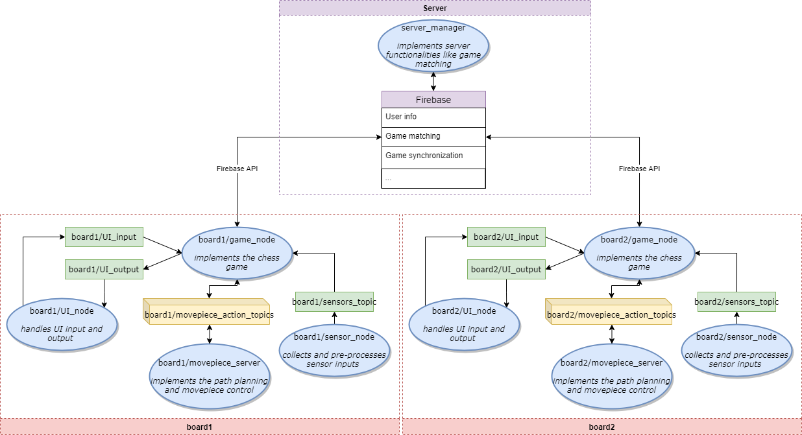
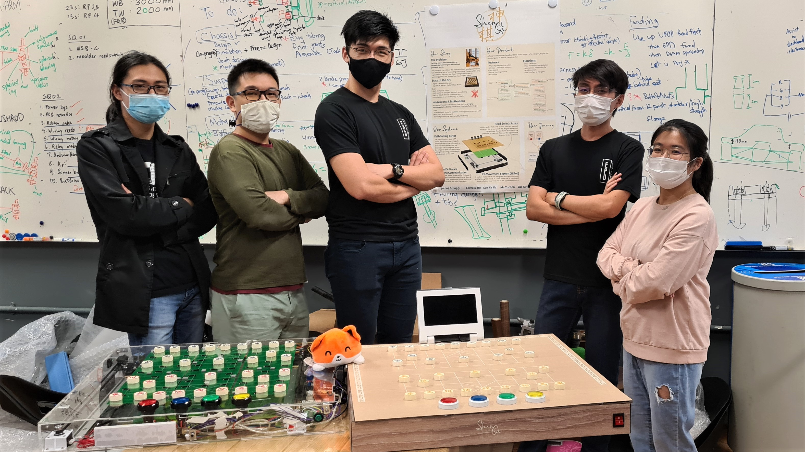

# ShenQi - A telepresence chinese chess board

[toc]

ShenQi was conceptualised as part of SUTD's 30.007 "Engineering Design Innovation" year 2 module. In the span of 13 short weeks, our team conceptualised and designed a custom product under the theme "Supporting the ageing population". 

### The Problem

Neighbourhood common spaces have been an intrinsic part of Singapore’s unique public housing landscape and a symbol of the “kampung spirit” living on despite our gentrified urban dwellings. These common spaces serve as a space where neighbours get to interact and meet in our increasingly isolated urban landscape. Nowhere is this more apparent than in the current COVID-19 climate, with safe distancing creating more distance between one another. 

Yet, COVID-19 has led to a myriad of new technological solutions to bring us closer together despite the our physical distances. These include [blank] However, the Elderly are a unique group who are unable to fully benefit from the positive effects of these technologies on our daily lives, due to the general lack of technological knowledge. As COVID-19 fuels the rapid digital transformation of our lives, the Elderly are being left behind. The common spaces in our neighbourhoods that used to be hotspots for them to interact have now become cordoned off, leaving the Elderly cooped up alone at home.

To tackle this problem, we came up with a solution to use technology to bring back these community interactions to the Elderly. In particular, by bringing the technology to the Elderly through familiar physical objects (and retrofitting them with smart tech), we believe that the Elderly will be at ease with using our product. 

### The Solution

In response to the problem of aged loneliness, our group conceptualised and prototyped ShenQi, a telepresence chinese chess board. By recognising the beneficial effects of using technology to link people together despite physical distances, and the Elderlies' fondness for chinese chess as a daily past time and community bonding activity, our group created a solution to allow previously lost pre-COVID19 experiences to be revived through technology

ShenQi is a chinese chess board that allows two players to play a physical game of Chinese Chess with each other, regardless of the physical distance. Each player playing a game of chinese chess will have his moves mimicked on the opposing player's chess board, allowing for the feeling of playing with someone else despite the physical distance. 

ShenQi is powered by off the digital devices, such as Raspberry Pi and Google's FireBasePI, to connect various chess boards through the internet. A network of belt driver stepper motors and magnetic chess pieces allow for chess pieces to "magically" move around on the chess board. Users will interact with a large 7" LCD screen and elderly-friendly 4 button user interface. These technologies are concealed in a box that has a familiar design aesthetic as a chinese chess board, including wooden surfaces and marble-like chess pieces.

### Systems Overview

#### Mechanical System

The "magic" chess pieces involved utilising the power of magnetism to both sense and move them. 3D printing was an easy and common method to embed magnets within the chess pieces. The size of magnets and solenoids was optimised to ensure sufficient magnetic force.

The movement of chess pieces involved constructing a cartesian movement system to carry an off the shelf cylindrical electromagnet. A H-Bot system was chosen for its simplicity and ease of engineering construction. The H-bot system utilises 2 stepper motors and a belt drive system. Smaller than typical motors were able to be chosen to reduce weight and overall size of the product, while maintaining sufficient speed, accuracy and torque for our application. 

#### Electrical System

#### Software System

The software stack runs off a Raspberry Pi 4 with internet connectivity to a Firebase server. With a game-node simulating the whole chinese chess game from start to finish, the Pi is able to process all the players moves from the sensing system and respond accordingly (from firebase game synchronisation) locally. The movement system was not easy to conceptualise, as the the product had to pathfind its way past chess pieces on the board and deal with situations where it was "trapped" in place by moving multiple chess pieces to find a path to the desired location. This system was done by a A* path planning algorithm nested in BFS. This allowed for almost all edge cases to be covered under the movement system. 

With initial testing, the system performed well on a Pi4, with game connection and sensing/movement at satisfactory speeds that did not significantly impair user experience.

### Future Work

[tbd]

### Acknowledgements

Special thanks to Professor Pablo Valdivia y Alvarado, Professor Subburaj Karupppasamy and the rest of the teaching team for their time, dedication and guidance. Special thanks to all the judges who took their time off to visit our exhibition, be it physically or virtually, for the meaningful discussion session with us and giving us your 

**The Team:**

- Tan Kai Jie (SUTD EPD, Beyond Industry 4.0 Track)
- Cornelia Ho (SUTD EPD, Electrical Engineering Track)
- Gan Jia Jie (SUTD EPD, Beyond Industry 4.0 Track)
- Lui Yan Le (SUTD EPD, Beyond Industry 4.0 Trakc)
- Ma Yu Chen (SUTD EPD, Robotics Track)

